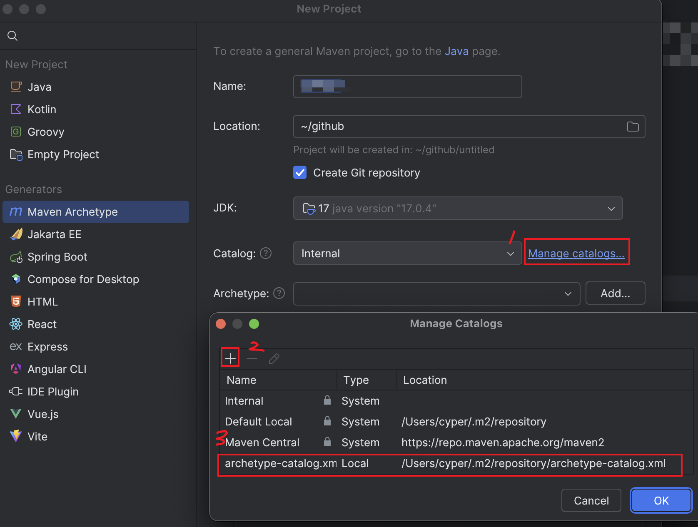
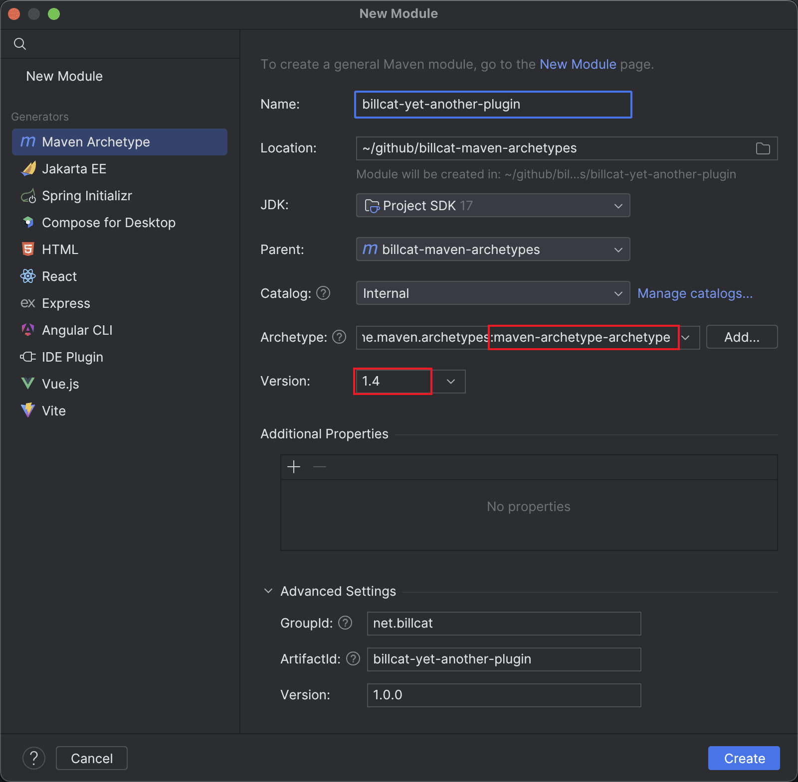

# Billcat maven archetypes

You can use maven archetype to quickly create your new java project, however, the built-in maven archetypes are either outdated or not suitable for our needs, hence I created this project.

This project contains the following archetypes:

```
net.billcat.archetypes
├── simple-jar
├── simple-boot3
├── simple-pom
├── multi-module-boot3
├── multi-module-cloud
├── multi-module-cloud-jpa
├── multi-module-cloud-alibaba
├── multi-module-cloud-k8s
└── submodule
```

| # | Archetype name             | Comment                                              |
|---|----------------------------|------------------------------------------------------|
| 1 | simple-jar                 | same with maven-archetype-quickstart but with junit5 |
| 2 | simple-boot3               | same with https://start.spring.io                    |
| 3 | simple-pom                 | just a pom.xml file, good for empty new project      |
| 4 | multi-module-boot3         | spring boot only multi-module project                |
| 5 | multi-module-cloud         | spring cloud + mybatis plus                          |
| 6 | multi-module-cloud-jpa     | spring cloud + jpa                                   |
| 7 | multi-module-cloud-alibaba | spring cloud alibaba                                 |
| 8 | multi-module-cloud-k8s     | spring cloud kubernetes                              |
| 9 | submodule                  | good for create a new submodule                      |


## Getting started

Follow some simple steps, you will get the archetypes as shown in the Intellij IDEA screenshot below (and use it locally)

### 1. Install maven archetypes into your local maven repository

```shell
# Clone this project and install maven archetypes into your local maven repository.

git clone https://github.com/billcat-projects/billcat-maven-archetypes.git
cd billcat-maven-archetypes
mvn clean install

```

### 2. Option 1: Now you can create new project from command line.

```shell
mvn archetype:generate \
-DarchetypeGroupId=net.billcat.archetypes \
-DarchetypeArtifactId=simple-jar \
-DarchetypeVersion=1.0.0 \
-DgroupId=com.yourcompany.demo \
-DartifactId=your-project-name \
-Dversion=1.0.0-SNAPSHOT
```

1. Parameter `archetypeGroupId` is always `net.billcat.archetypes` if you want to use this plugin
2. Parameter `archetypeArtifactId` is the `Archetype name` list in the above table(You should be able to see them in the dropdown)
3. Parameter `archetypeVersion` is currently `1.0.0`
4. The remaining 3 parameters are your own ones, change them freely based on your needs.

### 2. Option 2: If you prefer creating projects from IDE, here is a screenshot.


If you can't see `Catalog` or items in the dropdown, Click `Manage catalogs...` button next to it, and add `archetype-catalog.xml` file as shown in the following picture.



Tips: Although archetype-catalog.xml file is auto-generated by `mvn install`, you can edit and save it.

## Known issues

When creating new project, `maven-archetype-plugin` will automatically add `<parent>...</parent>` tag in `pom.xml` for its submodule, this is fine for normal multi-module project.

```
ROOT/
 +- pom.xml
 +- dependencies/
 |   \- pom.xml   <==  some <parent> tag will be added automatically here.
 ```

However, in our projects, the relationship is inverted, project `ROOT` depends on project `dependencies`. I can't find any `maven-archetype-plugin` configuration to let it stop adding `<parent>` tag for its submodules. You have to remove the `<parent>` tag in `dependencies` project manually.

## Developer guide

Use these settings for new plugins:




## Issues and comments

Leave your comments and suggestions in the issues area. For example, if you want a slightly different tech stack.

Also, if you like my demo, ~~please consider buying me a coffee~~. Please follow and star :).

## License

[Apache 2.0 license](https://www.apache.org/licenses/LICENSE-2.0.html) .
