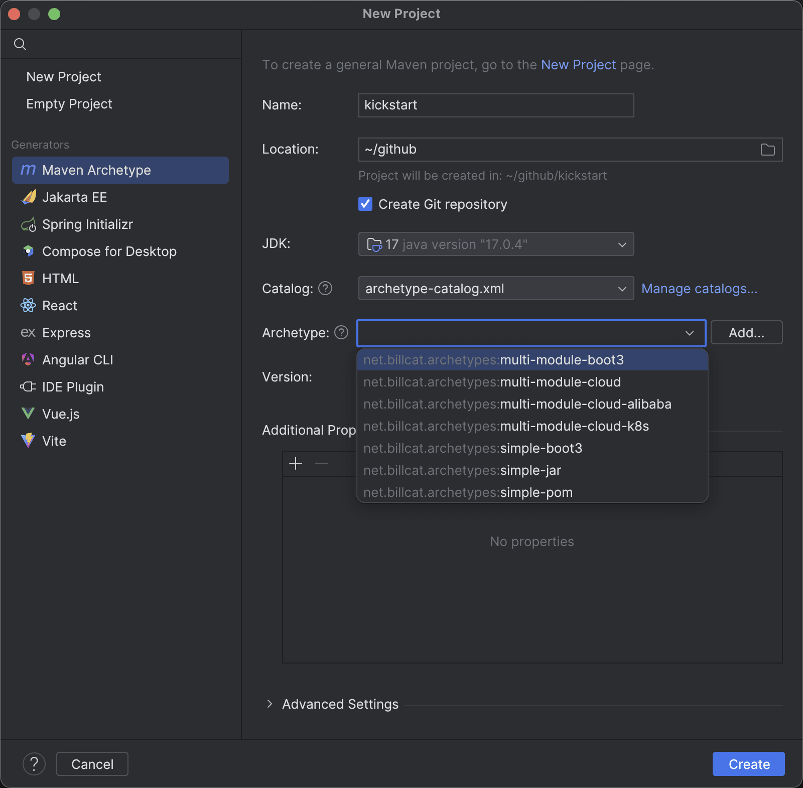

# Billcat Maven Archetypes

```
net.billcat.archetypes
├── simple-jar
├── simple-boot3
├── simple-pom
├── multi-module-boot3
├── multi-module-cloud
├── multi-module-cloud-alibaba
├── multi-module-cloud-k8s
└── submodule
```

## Getting started

```shell
git clone git@github.com:billcat-projects/billcat-maven-archetypes.git
cd billcat-maven-archetypes
mvn clean install
```

From command line.

```shell
mvn archetype:generate \
-DarchetypeGroupId=net.billcat.archetypes \
-DarchetypeArtifactId=simple-jar \
-DarchetypeVersion=1.0.0
```
Or use it from IJ IDEA:



## Known issues

When creating new project, `maven-archetype-plugin` will automatically add `<parent>...</parent>` tag in `pom.xml` for its submodule, this is fine for normal multi-module project.

```
ROOT/
 +- pom.xml
 +- dependencies/
 |   \- pom.xml   <==  some <parent> tag will be added automatically here.
 ```

However, in our projects, the relationship is reversed, project `ROOT` depends on project `dependencies`. I can't find any `maven-archetype-plugin` configuration to let it stop adding `<parent>` tag for its submodules. You have to remove the `<parent>` tag in `dependencies` project manually.

## License

[Apache 2.0 license](https://www.apache.org/licenses/LICENSE-2.0.html) .

Copyright (c) The Billcat Authors. 
